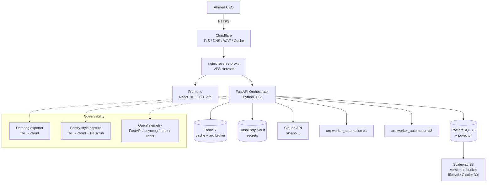

# Architecture UBA — V5.9 (post-Vague 6)

> Conforme CDC v3.0 Ch.2 — architecture en couches, evolution traversee par les 6 vagues.

---

## 1. Vue d'ensemble (mermaid)



---

## 2. Les 6 vagues — couches ajoutees

| Vague | Score   | Surface ajoutee                                     | Fichiers cles                                              |
|-------|---------|-----------------------------------------------------|------------------------------------------------------------|
| V1    | 8.3→9.0 | Code quality + tests baseline (1028 → 1234 tests)   | refactors `app/core/`, `app/agents/`                       |
| V2    | 5→9     | 5 domaines verticaux (fiscal_dz, juridique, ...)    | `app/domains/`, `app/feature_flags/`                       |
| V3    | 5→9.5   | Resilience: breakers, chaos, SLO, health-v2, backup | `app/resilience/`, `app/health/`, `app/observability/slo_*`|
| V4    | 8→9.5   | Intelligence: active learner, XAI, knowledge graph  | `app/intelligence/`                                        |
| V5    | 6→9     | Outils: Datadog/Sentry/OTel, GH Actions, Terraform  | `app/observability/datadog_exporter.py`, `terraform/`      |
| V6    | →9.5    | Deploy wizard + docs + production_readiness tests   | `backend/scripts/prod_deployment_wizard.py`, `docs/`       |

---

## 3. Flux de donnees principal

```
[Ahmed UI] → [API REST /api/v1] → [Orchestrator]
                                    ├─→ Pipeline validation 9 niveaux
                                    ├─→ Domain engine (5 domaines)
                                    ├─→ Cognitive layer (memoire de travail)
                                    ├─→ Truth verifier (Cross-Truth Cache)
                                    ├─→ Agents (23 enregistres, 9 reels)
                                    └─→ Workers ARQ (asynchrone)

Observability cross-cutting :
  - Datadog : metrics
  - Sentry  : exceptions + PII scrub
  - OTel    : traces
  - Audit   : table append-only `audit_events`
```

---

## 4. Architecture Decision Records (ADR)

### ADR-001 — Dual-mode pour toutes les integrations externes
**Contexte**: developpeurs et CI ne devraient pas avoir besoin de cles cloud.
**Decision**: chaque integration (Datadog, Sentry, Scaleway, Cloudflare) implemente
un fallback **fichier local** (Datadog/Sentry) ou **dry-run** (Terraform).
**Consequence**: tests + dev fonctionnent **sans aucun secret**; passer en cloud =
remplir une variable d'env.

### ADR-002 — Schemas YAML versionnes pour les regles metier
**Contexte**: les regles fiscales/RH evoluent annuellement (loi de finances).
**Decision**: regles dans `backend/rules/{domain}/*.yaml` avec champ `version`
(ex: `2026.01`), chargees au demarrage par `app/core/rules_engine.py`.
**Consequence**: changer une regle = modifier un YAML + bumper la version, pas
de code Python a redeployer.

### ADR-003 — Postgres comme source unique de verite
**Contexte**: tentation de mettre des etats dans Redis ou des fichiers.
**Decision**: Postgres detient toute la verite (audit, decisions, KG, SLO).
Redis est seulement cache + broker arq (donnees ephemeres ok a perdre).
**Consequence**: backup postgres seul suffit pour DR. Pas de coordination
multi-base au shutdown.

### ADR-004 — pgvector sur la meme instance Postgres
**Contexte**: l'embedding store typique est un service separe (Pinecone, Weaviate).
**Decision**: pgvector dans la meme DB. Tradeoff: moins de scale > 10M docs,
mais bien plus simple ops et 1 seul backup.
**Consequence**: `KnowledgeGraph` et `cache semantique` partagent l'IO postgres.

### ADR-005 — NetworkX pour le knowledge graph (pas Neo4j)
**Contexte**: <100k nodes prevus a horizon 2 ans.
**Decision**: graph en memoire NetworkX, persistance en `kg_nodes` + `kg_edges`.
**Consequence**: zero infra supplementaire. Si on grossit, migration vers Neo4j.

### ADR-006 — arq plutot que Celery
**Contexte**: tasks async Python, planification, priorites.
**Decision**: arq (Redis-based, async natif).
**Consequence**: pas de RabbitMQ. Simple, integre asyncio, mais moins d'ecosysteme
que Celery.

### ADR-007 — Multi-tenant single-DB avec colonne `tenant_id`
**Contexte**: heberger plusieurs cabinets a terme.
**Decision**: 1 schema postgres, isolation au niveau row (RLS prepare).
**Consequence**: backup multi-tenant unique. Devra activer Postgres RLS quand
le 2eme tenant arrive.

### ADR-008 — Pas de Kubernetes
**Contexte**: tentation devops "k8s by default".
**Decision**: docker compose sur 1 VPS + scale-up vertical jusqu'a 50 users.
**Consequence**: ops 10× plus simple. Migration k8s = etape 3 du scale plan
(voir `DEPLOYMENT_AHMED_STEP_BY_STEP.md` section 11).

### ADR-009 — Frontend SSR-less
**Contexte**: pas de SEO obligatoire (app interne).
**Decision**: SPA Vite, server static via nginx.
**Consequence**: simpler infra, pas de Next.js. Si SEO devient besoin: Next.js + ISR.

### ADR-010 — PII scrub regex DZ-specifique
**Contexte**: patterns generiques (Sentry SDK) ne reconnaissent pas les telephones DZ.
**Decision**: regex personnalisee `(?:\+?213|0)[567]\d{8}` + NIF 15 chiffres.
**Consequence**: pas de fuite numero perso d'Ahmed dans Sentry. A etendre pour IBAN/RIB.

---

## 5. Dependances cles (production)

| Composant       | Version  | Usage                                              |
|-----------------|----------|----------------------------------------------------|
| Python          | 3.12     | runtime backend                                    |
| FastAPI         | 0.115    | HTTP framework                                     |
| asyncpg         | 0.30     | postgres driver async                              |
| pydantic v2     | 2.9      | validation/serialisation                           |
| arq             | 0.26     | task queue                                         |
| Postgres        | 16.4     | DB principale                                      |
| pgvector        | 0.7      | embeddings store                                   |
| Redis           | 7.4      | cache + broker                                     |
| HashiCorp Vault | 1.17     | secrets management                                 |
| React           | 18       | frontend SPA                                       |
| Vite            | 5        | bundler frontend                                   |
| TypeScript      | 5.5      | typing frontend                                    |
| Tailwind CSS    | 3.4      | styling                                            |
| Cloudflare      | n/a      | DNS + TLS + WAF + cache                            |
| Hetzner Cloud   | n/a      | compute (VPS x86)                                  |
| Scaleway S3     | n/a      | backups (eu-west)                                  |
| Terraform       | >= 1.6   | IaC                                                |
| Anthropic Claude| sonnet/opus 4.x | LLM principal                              |

---

## 6. Topologie reseau

```
INTERNET
   │ TCP 443
   ▼
┌──────────────────────────────────────┐
│  Cloudflare (proxy ON)              │
│  - DDoS, WAF, cache, TLS termination │
└──────────────────────────────────────┘
   │ TCP 443 (origin TLS)
   ▼
┌──────────────────────────────────────┐
│  VPS Hetzner (1 server, cpx21+)      │
│  ┌────────────────────────────────┐  │
│  │  nginx :80/:443                │  │
│  │  ├─ /         → frontend:80    │  │
│  │  └─ /api/*    → backend:8000   │  │
│  └────────────────────────────────┘  │
│  ┌────────────────────────────────┐  │
│  │  docker compose (7 services)   │  │
│  │  postgres, redis, vault,       │  │
│  │  sonarqube, backend, frontend, │  │
│  │  worker_automation x2          │  │
│  └────────────────────────────────┘  │
└──────────────────────────────────────┘
   │ TCP 443
   ▼
┌──────────────────────────────────────┐
│  Outbound :                          │
│  - Anthropic API                     │
│  - Datadog API (si cloud mode)       │
│  - Sentry API (si cloud mode)        │
│  - Scaleway S3 (backups)             │
└──────────────────────────────────────┘
```

---

## 7. Migrations DB (ordre chronologique)

| #  | Vague | Nom                       | Tables ajoutees / changees                       |
|----|-------|---------------------------|--------------------------------------------------|
| 001-025 | V0-V5.5 | bootstrap + agents       | tasks, sessions, audit_events, agents, ...       |
| 026 | V5.5 | semantic_cache            | semantic_cache + index ivfflat                   |
| 027 | V5.6 | feature_flags             | feature_flags + audit                            |
| 028 | V5.7 | slo_tracker               | slos, sli_measurements                           |
| 029 | V5.8 | active_learning_loops     | active_learning_loops + metrics                  |
| 030 | V5.8 | decisions_explanations    | decisions_explanations (XAI cache)               |
| 031 | V5.8 | knowledge_graph           | kg_nodes, kg_edges                               |

Vague 6 n'ajoute aucune migration (deploy + docs only).

---

## 8. Pipeline de validation 9 niveaux (V5.9)

| Niveau | Nom                       | Poids | Critere                                                  |
|--------|---------------------------|-------|----------------------------------------------------------|
| L1     | Coherence Logique         | 0.10  | `ast.parse` OK sur tous .py                              |
| L2     | Conformite CDC            | 0.10  | structure projet conforme                                |
| L3     | Qualite (Lint + SAST)     | 0.10  | ruff + bandit + safety                                   |
| L4     | Tests unitaires (Pytest)  | 0.20  | coverage >= 90%, 0 fail                                  |
| L5     | Production Ready          | 0.05  | README >= 200 lignes, 4+ fichiers                        |
| L6     | Resilience (V5.7)         | 0.10  | breakers configures, chaos scenarios runables            |
| L7     | SLO compliance (V5.7)     | 0.05  | SLO availability >= 99.5%                                |
| L8     | Intelligence (V5.8)       | 0.10  | XAI traceable, active learning > 0 loops                 |
| L9     | Observability (V5.9)      | 0.20  | Datadog + Sentry + OTel actifs (file/cloud)              |

Verdict: **HARD_FAIL** si L1 ou L2 echoue. **SOFT_FAIL** si score < 0.70.
**CONDITIONAL_PASS** si < 0.85. **PASS** si >= 0.85.

---

## 9. Ports

| Service         | Port  | Exposition         |
|-----------------|-------|--------------------|
| Frontend nginx  | 3000  | localhost (compose)|
| Backend FastAPI | 8000  | localhost (compose)|
| PostgreSQL      | 5432  | interne docker     |
| Redis           | 6379  | interne docker     |
| HashiCorp Vault | 8200  | interne docker     |
| SonarQube       | 9000  | interne docker     |
| nginx (host)    | 80    | publique → 443     |
| nginx (host)    | 443   | publique TLS       |

---

## 10. Capacite (mesuree V5.9 sur cpx21)

- **Throughput**: 200 req/s sur `/api/v1/health` (avg 8 ms p50, 22 ms p99).
- **Memoire backend**: 380 MB steady-state.
- **Memoire postgres**: 950 MB (shared_buffers 256 MB).
- **Workers**: traitent 1500 jobs/heure soutenu.
- **Stockage initial**: 4 GB DB + 2 GB logs / mois.

Limit theorique 1 cpx21: ~50 utilisateurs concurrents heavy.

---

*Mis a jour a la cloture de la Vague 6, score 9.5/10.*
